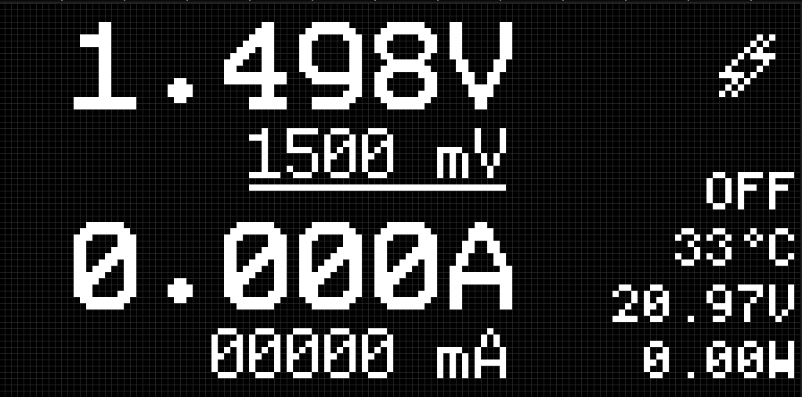

# FixPD - Portable Programmable Power Supply

Specifically built for being used on the go where there's no power outlet available, but a USB-C PD powerbank (e.g. iFixit FixHub).

Featuring USB-C PD input (preferrably 15V or 20V), 128x64 monochrome OLED display and a single rotary knob for controlling voltage and current.

It requires at least 9V input and can output up to about `VIN - 5V` and up to 5A.

## Hardware

This pps relies on some prebuilt modules that work together.
- m5stack Module13.2 PPS
- Proffieboard V2 (pick any Arduino Nano; I had a spare Proffieboard which is likely an overkill)
- 128x64 OLED display (SSD1306)
- 5V <-> 3.3V level shifter
- 5V -> 3.3V buck converter
- Rotary encoder
- USB-C PD 20V trigger module

## Firmware

Works with Arduino IDE. Install following dependencies to get started in Arduino IDE:
- U8G2
- RotaryEncoder
- OneButton

## 3D printed case
Printed [the case](print/fixpd%20case.3mf). Used the knob from https://makerworld.com/de/models/628840-ec11-encoder-knob.  
PETG is recommended
